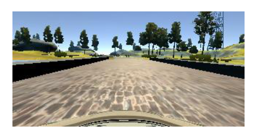

# Behavioral Cloning Project

## Data

The data supplied by Udacity was used. This data was downloaded from the Project Resources page in the Card ND on-line classroom.

From discussions on the Slack channel and the forum, I gathered that the use of a joystick was necessary to generate smooth steering data. Since I do not possess a joystick, I therefore chose to use the data from Udacity.

No extra data was created to supplement the Udacity data. Some people have suggested creating additional recovery data. This is data which is intended to show the car what to do in situations where it is likely to drive off the road. In my view this is not necessary when using the data augmentation which I describe in this rapport. The fact that my car is able to drive around both tracks without this kind of data, proves the point. 

## Pre-processing The Data

The camera images are all cropped before they are fed to the neural network. Not just the images from the training and validation data are cropped by also those used when actually running the car in autonomous mode. The *drive.py* file will access the function in *model.py* for this purpose.

The images are cropped in order to remove irrelevant elements such as:

- The top of the image which contains the sky, trees, mountain tops, and so on.
- The bottom of the image which contains the hood of the car.

In this fashion, the neural network will be fed exactly the part of the camera image which shows the position of the car with respect to the edges of the road and also its heading.

The top image shows a raw camera image from the center camera of the car. The bottom image shows the cropped version with only the relevant part of the road.

The specific values at which to crop the image where suggested by various people on Slack. I tried to change them to see if that yielded a better cropping, but came to the conclusion that the suggested values were indeed optimal.

## Data Augmentation

Before experimenting with data augmentation, I decided to look at other people's work for inspiration. Mostly I looked at the work by Vivek Yadav, Subodh Malgonde and the NVIDIA team. The Slack channel and the ND forum were also of help.

After the training and validation data is pre-processed, it is sent to the *get_augmented* function. Here 4 things happen.

### Flipping the camera images left/right

This is the most basic and obvious way to augment the data. The camera image is flipped left/right in order to remove the bias towards left turns. The steering angle is adjusted by changing the sign.

The top image shows the original camera image, whereas the bottom image shows the flipped image.

### Using all 3 cameras

When I started out, I just used the images from the center camera but my car often had the tendency to drive off the road. So, given that there are 3 camera images to choose from per data sample, we might as well make use of them. 

The top image shows a (pre-processed) image from the center camera. The middle image is from the left camera and the bottom image is from the right camera.

So now, the center/left/right camera image is chosen at random per data sample. In order to compensate for the shift to the left or right when using those cameras the steering angle is adjusted accordingly. A value of 0.25 is added or subtracted to/from the steering angle given in the data sample respectively.

This already improved keeping the car on the road, but it was not sufficient for the really sharp turns. I tried changing the value added/subtracted to/from the steering angle but this did not help.

### Shifting camera images left or right

In order to keep the car on the road in the sharp turns the camera image needs to be shifted left or right. This is done according to a normal distribution. When the image is shifted, the steering angle is also adjusted to reflect the shift.

In order to reduce the amount of zig-zag by the car in autonomous mode, the shift is only introduced when the steering angle is above 0.01. By doing this the bias is still maintained towards driving straight. i.e. When the car is driving straight in the training data, the image is not shifted. 

In the images below, we can see the original on top. The middle image is shifted left and the bottom image is shifted right.

This augmentation is also useful for running the car on track 2 where there are many sharp turns.

### Randomizing the brightness

This is not needed to keep the car on Track 1. Yet, for Track 2 it is necessary. On this track there are many shadows where obviously the brightness is less than on the sunny parts. 

In the images below, we can see the original on top. The bottom two have random brightness changes.

## Characteristics of the dataset

When using only the original data supplied by Udacity, the car drives off to the sides and over the edges of the road. When looking at the frequency distribution of the Udacity data we can see why this is the case. Below is a histogram showing the distribution of 1000 random samples.

There are very few steering angles larger or smaller than 0.0. The result is that the car cannot recover and steer left/right when needed. By augmenting the data, as mentioned above, including using all 3 cameras and shifting the images left/right, it is possible to increase the amount of left/right steering angles.

In the above histogram, which is based on 1000 random samples of the augmented data we can again see the  frequency distribution of the steering angles. The augmentation still creates a strong bias towards driving straight. Yet, at the same time much more data for driving left/right is now available. This is sufficient for keeping the car on the road.

While experimenting I discovered that it is important to maintain the large bias for driving straight. If this is diminished too much and the biases toward left/right steering are increased further, then the car will show a high(er) level of zigzag driving.

In addition, we can see in the histogram that the distribution is symmetric around 0.0. Thus, having no particular bias for turning left or right. Around 0.25 and -0.25 there is a higher frequency. This is due to the fact that use the left and right shifted images.

## Convolutional Neural Network

The neural network architecture chosen was inspired by the convolutional neural network (CNN) used by Comma.ai . Given that it had been used for a similar behavioral cloning project, I found it logical to use it as a starting point. My resulting CNN is thus a variation of the one used by Comma.ai .

### Structure of the network

1. *Normalization of inputs (between values -1.0 and 1.0)*
2. *Convolutional layer consisting of an 8x8 convolution with 16 output filters and a stride of 4x4*
3. *ELU activation function*
4. *Max Pooling layer*
5. *Convolutional layer consisting of an 5x5 convolution with 32 output filters and a stride of 2x2*
6. *ELU activation function*
7. *Convolutional layer consisting of an 5x5 convolution with 64 output filters and a stride of 2x2*
8. *Flatten layer*
9. *Dropout layer with dropout probability of 0.2*
10. *ELU activation function*
11. *Dense layer with 1024 neurons*
12. *Dropout layer with dropout probability of 0.5*
13. *ELU activation function*
14. *Dense layer with 512 neurons*
15. *Batch normalization layer*
16. *Dropout layer with dropout probability of 0.5*
17. *ELU activation function*
18. *Dense layer with 1 neuron and Tanh activation function*

### Graphical representation of the network

### Experimentation

This structure was the result of trial and error starting off with the CNN by Comma.ai . Some of the (other) things I tried was:

- Adding Convolutional layers with different amount of output filters.
- Adding Dense layers of different sizes.
- Using different activation functions, mostly focusing on the Tanh function given its output range.
- Adding more Batch Normalization layers
- Different values for the Dropout probabilities
- Adding L2 regularization

Adding more layers seemed to lead to overfitting.

## Training

### Adam Optimizer

The training of the CNN was done using an Adam optimizer. I tried changing the learning rate, but decided that it was best to leave it as is.

### Fit generator

The Keras fit_generator function was set with the following parameters:

- batch size: 128
- training samples per epoch: ~20000
- validation samples per epoch: 3000
- number of epochs: 5

These values were found after a large amount of trial and error experimentation.

The CNN was first trained using training data. Validation data was also used to get an impression of the extent of overfitting or generalization done. Then, when the overfitting was largely eliminated I would test the car on Track 1 in autonomous mode. 

In the beginning the car would wander off to the side and crash outside the track. By experimenting with the various steering augmentations (as mentioned above) this problem was eventually resolved.

It was then quite amazing to also see the car drive on Track 2. The only addition needed to make the car drive on Track 2 was the brightness adjustments in the data (as mentioned above). No tweaking of the steering was necessary.

## Results

The car can drive on both tracks and stay within the bounds of the road. Here I supply two links to Youtube to show that this is indeed the case.

### Track 1

### Track 2

## References

Udacity data - https://d17h27t6h515a5.cloudfront.net/topher/2016/December/584f6edd_data/data.zip

Comma.ai - https://github.com/commaai/research/blob/master/train_steering_model.py

Vivek Yadav -  https://chatbotslife.com/using-augmentation-to-mimic-human-driving-496b569760a9#.ugbmw8vpw

Subodh Malgonde - https://github.com/subodh-malgonde/behavioral-cloning

NVIDIA team - https://images.nvidia.com/content/tegra/automotive/images/2016/solutions/pdf/end-to-end-dl-using-px.pdf

Car ND Slack channel - https://carnd.slack.com/

Car ND Forum - https://carnd-forums.udacity.com/

